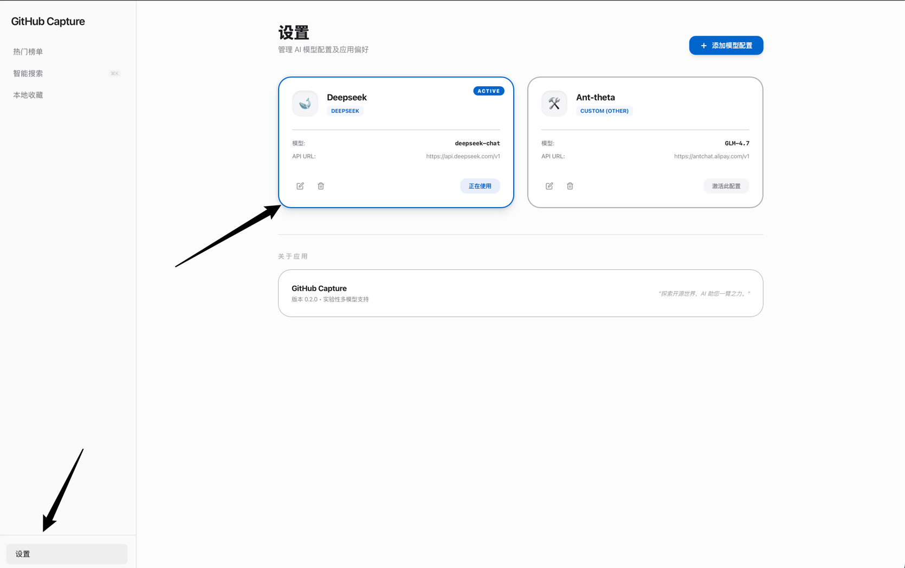
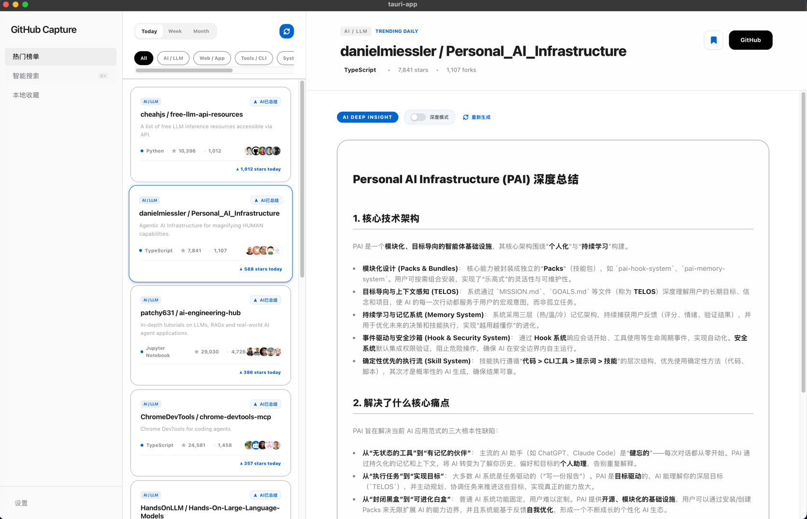
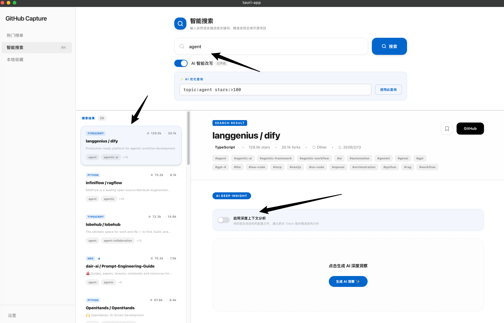

# GitHub Capture - Your AI-Powered Insight Tool for Open Source Projects

GitHub Capture is a desktop-based tool for exploring and analyzing open-source projects. It combines natural language search with AI-driven insights to help developers, tech enthusiasts, and product managers precisely discover the most valuable technical assets from the vast ocean of GitHub projects.

 *(Replace with your generated app screenshot)*

## 🚀 Core Features

- **🤖 Intelligent Semantic Search**: No longer limited by keywords. Through AI rewriting, use natural language (e.g., "Rust AI framework suitable for beginners") to accurately match the most relevant repositories.
- **🔥 Aggregated Trend Exploration**: Real-time crawling of GitHub Trending, supporting quick filtering of popular projects by language and time range (Today, This Week, This Month).
- **💡 Deep AI Insights**: One-click generation of project summaries, technical architecture analysis, core pain point interpretations, and quick start suggestions.
- **📂 Personal Project Library**: Conveniently collect projects of interest to build your own technical intelligence library.
- **✨ Premium UI/UX**: Designed based on modern visual language, supporting split-pane preview and providing a smooth desktop interaction experience.

## 🛠️ Tech Stack

- **Frontend**: React 19 + TypeScript + Tailwind CSS
- **Backend**: Rust + Tauri v2 (High-performance, secure, cross-platform)
- **Database**: SQLite (Local storage)
- **AI Engine**: Integrated LLM (Supports OpenAI, Claude, Gemini, DeepSeek, etc.)

## 📦 Developer Setup

### Prerequisites

- [Node.js](https://nodejs.org/) (v18+ recommended)
- [Rust](https://www.rust-lang.org/) (Latest stable version)
- [pnpm](https://pnpm.io/) or npm

### Running Locally

1. **Clone the repository**:
   ```bash
   git clone https://github.com/your-username/githubCapture.git
   cd githubCapture
   ```

2. **Install frontend dependencies**:
   ```bash
   npm install
   ```

3. **Start the development environment**:
   ```bash
   npm run tauri dev
   ```

### Production Build

Generate macOS local installation package:
```bash
npm run tauri build
```

## 📖 Usage Guide

1. **Configure AI**: Enter your LLM API Key in the settings interface (supports major LLM providers).

2. **Browse Trends**: Switch to the "Trending" page, select language and time range to view the hottest open-source projects.

2. **Search**: Enter your technical requirements in the "Intelligent Search" page.

3. **Analysis**: Select a project and click "AI Summary" to get deep technical insights.
4. **Management**: Click the "Star" icon to add projects to your collection library.

## 🤝 Contribution Guide

We welcome contributions from the community! Whether it's fixing bugs, improving the UI, or adding new AI analysis dimensions, please feel free to submit a Pull Request.

1. Fork the repository
2. Create your feature branch (`git checkout -b feature/AmazingFeature`)
3. Commit your changes (`git commit -m 'Add some AmazingFeature'`)
4. Push to the branch (`git push origin feature/AmazingFeature`)
5. Open a Pull Request

## 📄 License

This project is licensed under the **MIT** License. See the [LICENSE](LICENSE) file for details.

---

*Powered by Antigravity AI.*
